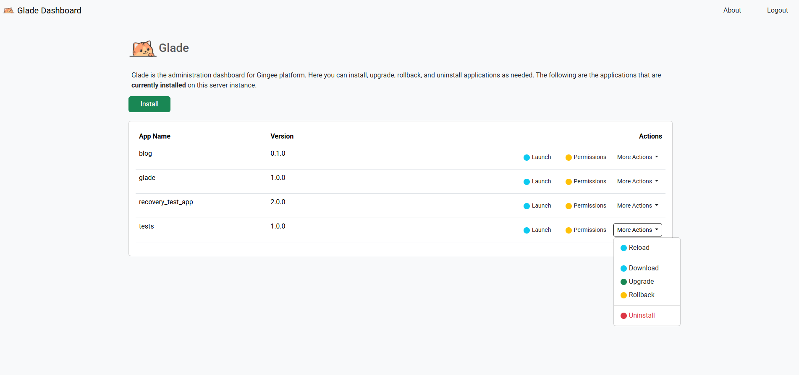
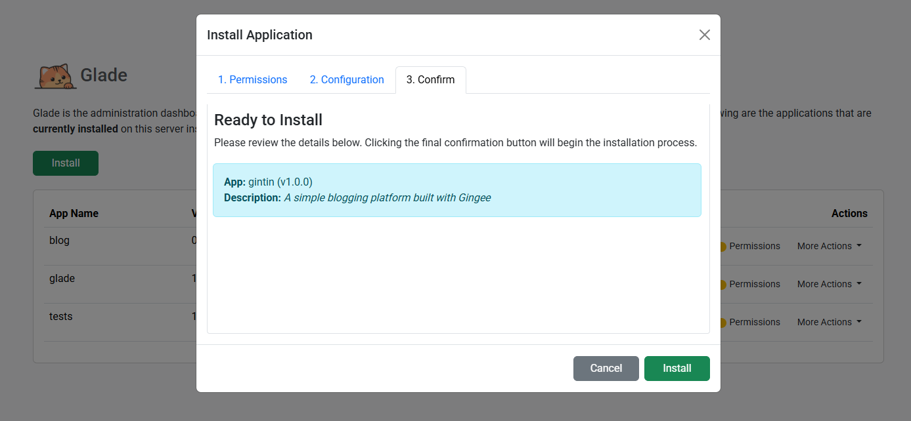

# Glade: The GingerJS Admin Panel

Glade is the official, web-based administration panel that is bundled with every GingerJS server. It provides a simple, secure, and powerful user interface for managing the entire lifecycle of all applications running on your server instance.

Glade is itself a GingerJS application, built to showcase the platform's capabilities. It is a **privileged app**, meaning it has special permission to use the powerful `platform` module to perform its administrative tasks.

## First-Time Access & Login

When you create a new GingerJS project using the `gingerjs-cli init` command, the Glade application is automatically installed and configured for you.

1.  **Initial Credentials:** During the `init` wizard, you are prompted for an administrator username and password. The CLI securely hashes the password using Argon2 and stores these credentials inside Glade's configuration file.

2.  **Configuration File:** The credentials are saved in `web/glade/box/app.json`:
    ```json
    // web/glade/box/app.json
    {
      "name": "glade",
      // ...
      "env": {
        "ADMIN_USERNAME": "admin",
        "ADMIN_PASSWORD_HASH": "$argon2id$v=19$m=..." 
      }
    }
    ```

3.  **Accessing Glade:** By default, GingerJS is configured to make Glade the `default_app`. To access it, simply navigate your browser to the root URL of your running server (e.g., `http://localhost:7070`). You will be automatically directed to the Glade login page.

## The Dashboard View

After a successful login, you are taken to the main Glade dashboard. This is your central hub for viewing and managing all applications.

**Login**


**Dashboard**


The dashboard consists of two main components:

1.  **The Header:** Contains the Glade title and a **Logout** button to securely end your session.
2.  **The Application List:** A table that displays every application currently installed and running on the GingerJS server.
    -   **App Name:** The unique ID of the application (corresponds to its folder name in `web/`).
    -   **Version:** The version number, as specified in the app's own `app.json` file.
    -   **Actions:** A set of buttons for performing lifecycle operations on each application.

## Core Features: Application Lifecycle Management

All major application management tasks can be performed directly from the Glade UI.

### Installing a New Application

This is for deploying a new application from a package file. Glade provides an intelligent, multi-step wizard to ensure applications are installed securely and correctly.

1.  Click the green **Install** button at the top of the application list.
2.  A modal dialog will appear, prompting for the **Application Name** and the **App Package File (.gin)**.
3.  Upon selecting a `.gin` file, Glade analyzes the package *in your browser* and transforms the modal into a tabbed installation wizard.
4.  **Permissions Tab:** The first tab will display the `mandatory` and `optional` permissions the application requires (read from its `pmft.json` manifest). You must review and consent to these permissions before proceeding.
5.  **Configuration Tab:** If the application requires any database connections, this tab will display a form for you to enter the connection details (host, user, password, etc.). For apps with multiple database requirements, this will be displayed as a convenient accordion.
6.  **Confirm Tab:** A final tab shows a summary of the installation.
7.  Clicking **Confirm & Install** securely repackages the application with your provided database configuration and installs it on the server with only the permissions you explicitly granted. The application list will then automatically refresh.

**Upload App Package(.gin) File**


**Grant Permissions**


**Configure App**


**Confirm Install**


### Managing App Permissions

Security is managed at the application level. You can review and change the permissions for any installed app at any time.

1.  In the application list, find the app you wish to configure and click its gray **Permissions** button.
2.  A modal dialog will appear, listing all available permissions in the GingerJS platform.
3.  Checkboxes will indicate the permissions currently granted to the app.
4.  You can grant or revoke permissions by toggling the checkboxes.
5.  Click **Save**. Glade will securely update the server's central permissions file and then automatically trigger a safe reload of the application to ensure the new rules are applied immediately.


### Upgrading an Application

This is for deploying a new version of an *existing* application. The process is nearly identical to a new installation, ensuring the same level of security and configuration.

1.  In the application list, find the app you wish to upgrade and click its blue **Upgrade** button.
2.  The installation wizard will appear, but the "Application Name" field will be pre-filled and read-only.
3.  After you select the new `.gin` package file, the wizard will analyze it and guide you through the same **Permissions** and **Configuration** tabs, allowing you to approve any new permissions the upgraded version requires.
4.  Glade will perform a secure, data-aware upgrade, creating a backup of the previous version before replacing the application's code.

**Upload App Package(.gin) File**


**Grant Permissions**


**Configure App**


**Confirm Upgrade**


### Packaging an Application (Download)

This allows you to create a distributable `.gin` package from a live, running application.

1.  In the application list, find the app you want to package.
2.  Click its **Download** button.
3.  Your browser will immediately begin downloading a `<app-name>.gin` file. This file can be used to install the application on another GingerJS server or for backup purposes.

### Rolling Back an Application

If a recent upgrade has caused issues, you can quickly and safely revert to the previous version.

1.  In the application list, find the app you wish to roll back.
2.  Click its yellow **Rollback** button.
3.  A confirmation modal will appear. Glade first analyzes the latest backup and presents a clear "diff," showing you which permissions will be granted or revoked if you proceed with the rollback.
4.  After you approve any permission changes, click the **Confirm** button. Glade will perform a safe, data-preserving rollback to the most recent backup of that application and apply the correct set of permissions.


### Uninstalling an Application

This is a destructive action that will permanently remove an application and all of its associated configuration and content.

1.  In the application list, find the app you wish to uninstall.
2.  Click its red **Uninstall** button.
3.  A confirmation modal will appear, asking you to type the application's name to confirm this irreversible action.
4.  Click the **Confirm** button. Glade will gracefully shut down the application's services, revoke its permissions, clear its caches, and delete its entire directory from the server.


## Administration & Security

### Logging Out

To securely end your administrative session, simply click the **Logout** button in the top-right corner of the header. This will delete your session on the server and clear the authentication cookie from your browser.

### Resetting the Admin Password

If you forget your Glade password, you cannot recover it. However, if you have command-line access to the server where GingerJS is running, you can securely reset it.

1.  Navigate to the root of your GingerJS project directory in the terminal.
2.  Run the following command from the `gingerjs-cli`:
    ```bash
    gingerjs-cli reset-pwd
    ```
3.  The tool will prompt you to enter and confirm a new password.
4.  It will then generate a new, secure password hash.
5.  Copy this entire hash and paste it into your `web/glade/box/app.json` file, replacing the old value for the `ADMIN_PASSWORD_HASH` key.
6.  Restart your GingerJS server. You will now be able to log in with your new password.
